# iPhone 价格曲线与最优购买策略分析

> 基于近十年(2016–2025)历代 iPhone 的一手价与二手价数据,用数学方法回答三个问题——
> **什么时候买、买哪一款、用多久再换最划算**,且在"尽量用上新科技"的前提下让每月成本最低。

> 在线阅读:本页即完整报告。另提供 `report.html`(单页自包含,6 张图内联,可离线打开)与 `report.md`。

---

## 1. 历代发布时间与首发价

### 1.1 美国发布价(基础存储,美元,不含税)

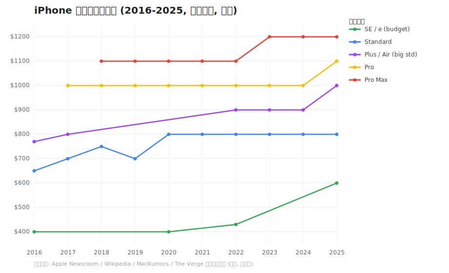

Apple 每年大致分四到五个价位档:入门(SE/e)、标准款、大屏标准款(Plus,2025 起被 Air 取代)、Pro、Pro Max。

| 档位 | 价格走势(USD) |
|------|----------------|
| 入门 SE/e | SE一代399 → SE二代399 → SE三代429 → 16e 599 |
| 标准款 | 7:649 → 8:699 → XR:749 → 11:699 → 12~16:799 → 17:799 |
| 大屏标准 Plus/Air | 7P:769 → 8P:799 → 14/15/16 Plus:899 → Air:999 |
| Pro | X/XS/11~16 Pro 连续 8 年 999 → 17 Pro:1099 |
| Pro Max | XS Max~14 ProMax:1099 → 15~17 ProMax:1199 |

**关键趋势**

- 标准款自 2020 年起长期锁定 799 美元,非常稳定。
- Pro 档连续 8 年(2017–2024)守住 999 美元,直到 2025 年 iPhone 17 Pro 才涨到 1099。
- Pro Max 名义最高价从 1099 涨到 1199,但 Apple 常用"涨价同时翻倍存储"的方式,使同存储价格其实没变。
- 入门档涨幅最明显:399 一路抬到 16e 的 599。

### 1.2 发布时间规律

数字系列固定每年 9 月发布、当月中下旬首销;SE/e 系列在春季(2~3 月)发布。**旧机要在下一代发布前(8 月底)出手**,否则发布会一开就掉一档。

---

## 2. 国行二手价与折旧曲线

### 2.1 首发价 vs 当前二手价

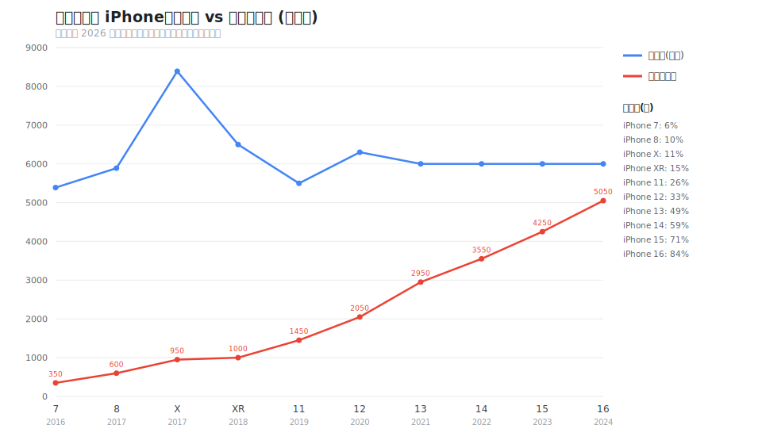

标准款国行"首发价 → 当前二手价(2026 年初,良好成色/主流存储)→ 残值率":

| 机型 | 首发(¥) | 二手(¥) | 残值率 |
|------|---------|---------|--------|
| 7 (2016) | 5388 | 350 | 6% |
| 8 (2017) | 5888 | 600 | 10% |
| X (2017) | 8388 | 950 | 11% |
| XR (2018) | 6499 | 1000 | 15% |
| 11 (2019) | 5499 | 1450 | 26% |
| 12 (2020) | 6299 | 2050 | 33% |
| 13 (2021) | 5999 | 2950 | 49% |
| 14 (2022) | 5999 | 3550 | 59% |
| 15 (2023) | 5999 | 4250 | 71% |
| 16 (2024) | 5999 | 5050 | 84% |

### 2.2 折旧曲线

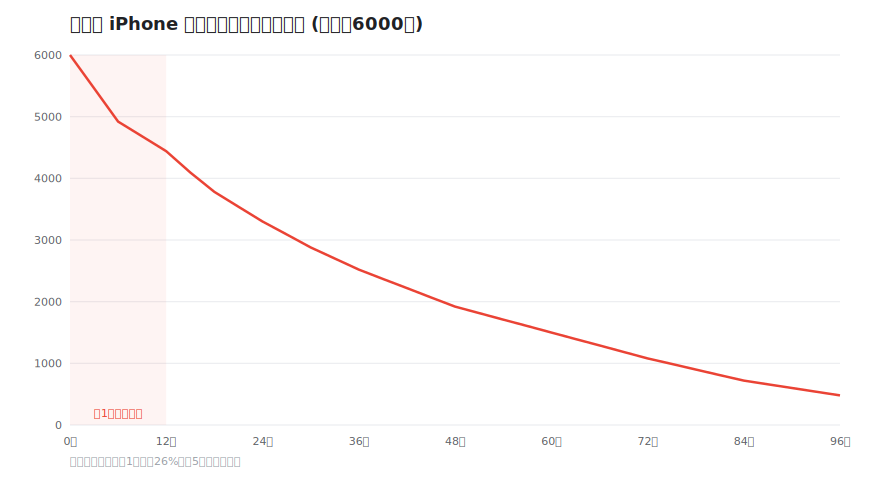

折旧近似指数衰减:**前 1 年掉得最猛(约 26%),之后趋缓,5 年后基本触底**。大致规律:满 1 年残值约 80%,满 2 年约 60%,满 3 年约 50%,满 4 年约 33%,5 年以上跌破 25%。

---

## 3. 数学模型

把"每月真实损耗"形式化。

**单段持有成本:**

    月成本 = (买入价 - 卖出价) / 持有月数

设首发价 P、残值率 rr(t) = 回收价 / 首发价(t 为机龄月数)。买入机龄 a、持有 h 个月时:

    买入价 = P * rr(a)
    卖出价 = P * rr(a + h)
    g(a, h) = P * (rr(a) - rr(a+h)) / h

多部手机连续使用时,**长期平均月成本 = 各段折旧之和 / 总月数**,即各段 g 的加权平均。因此全局最优等价于:让每一段的 g 最小。

**用户案例验证**:iPhone 16 买入 6069,14 个月回收 4150 →
g = (6069 − 4150) / 14 = **137 元/月**。

---

## 4. 策略空间分析

### 4.1 月成本 vs 持有时长

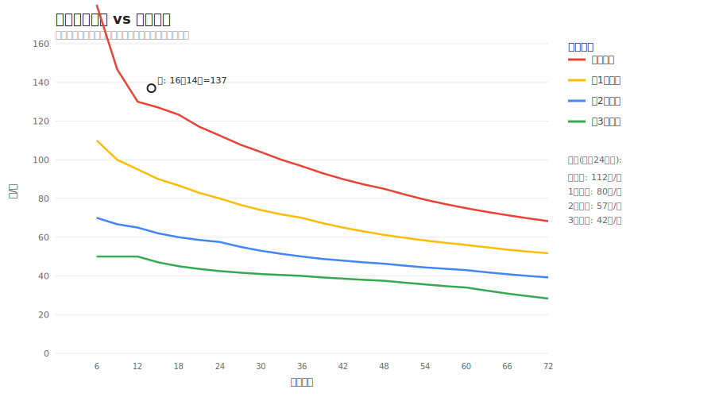

g 有两条单调性(因 rr 递减且凸):

- **对持有时长 h 递减**:持有越久越省(陡降被摊薄)。买全新持有 12/24/36/48/60 月 ≈ 130/112/97/85/75 元/月。
- **对买入机龄 a 递减**:买得越旧越省(绝对折旧变小)。都持有 24 个月:买全新 112、1 年二手 80、2 年二手 57、3 年二手 42 元/月。

数学上的无约束最优 = 买尽量旧 + 持有尽量久,但这会牺牲性能/新鲜度,所以真正的解是**带约束的优化**。

### 4.2 新科技 vs 省钱:帕累托最优前沿

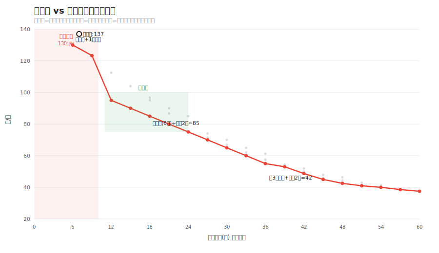

定义"新鲜度":持有期内平均机龄 = a + h/2,越小代表用的科技越新。每个策略 (a, h) 是一个点 (平均机龄, 月成本)。求"同等新鲜度下最便宜"的点,得到红色前沿曲线:

| 平均机龄(月) | 月成本(¥) | 最优策略 |
|---------------|------------|----------|
| 6 | 130 | 买全新,持有 12 月 |
| 12 | 95 | 买 6 月二手,持有 12 月 |
| 18 | 85 | 买 6 月二手,持有 24 月 |
| 24 | 75 | 买 6 月二手,持有 36 月 |
| 36 | 55 | 买 30 月二手,持有 12 月 |
| 48 | 42 | 买 36 月二手,持有 24 月 |

**前沿有明显拐点**:平均机龄 6 → 18 个月,月成本从 130 暴跌到 85;18 → 60 个月只从 85 缓慢降到 37。所以性价比甜点在**平均机龄 12~18 个月**这一段。

---

## 5. iPhone 18 二手价预测与抄底时点

> 假设 iPhone 18 于 2026-09 发布、国行标准款首发 ¥5999,沿用前述折旧曲线推演(预测值,非官方)。

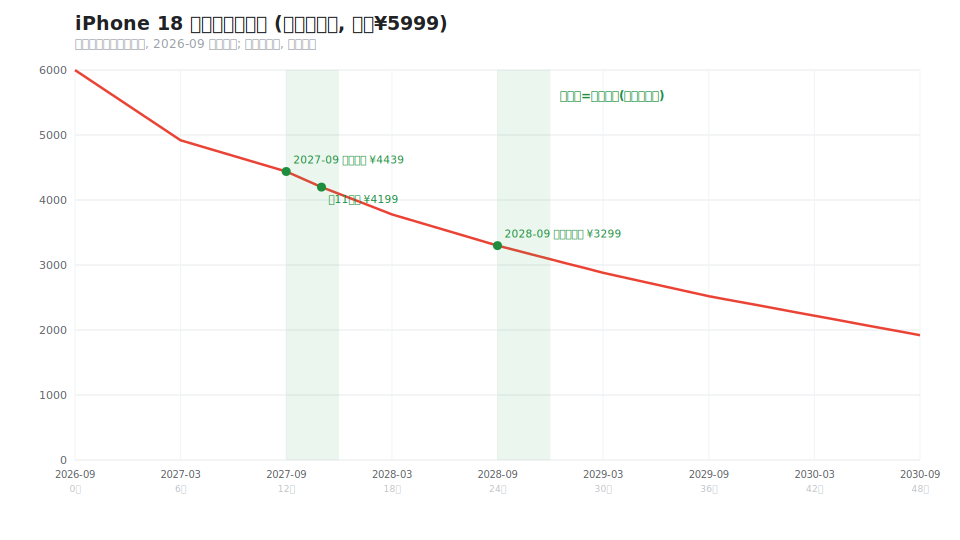

| 时间 | 机龄 | 预测回收价 | 残值 | 说明 |
|------|------|-----------|------|------|
| 2026-09 | 0 | ¥5999 | 100% | 首发 |
| 2027-03 | 6月 | ¥4919 | 82% | 第一波价稳 |
| 2027-09 | 12月 | ¥4439 | 74% | iPhone19 发布,台阶下跌 |
| 2027 双11 | 14月 | ¥4199 | 70% | 促销低点 |
| 2028-09 | 24月 | ¥3299 | 55% | 性价比顶点 |
| 2030-09 | 48月 | ¥1920 | 32% | 趋于触底 |

**抄底结论**

- 想买二手 18 自用最划算 → **2027-09(iPhone19 发布后)到 2027 双11** 抄底,约 ¥4200,是仅 1 代差的现代旗舰,买后持有 2 年月成本约 **74 元**。
- 若更看重省钱、不在意代差 → **2028-09** 买入(约 ¥3300),持有 2 年月成本低至 **57 元/月**。
- 要首发尝鲜 → 2026-09 全新买,但务必持有 ≥ 2 年再换。

---

## 6. 结论与购买策略

### 你现在的位置
买全新 + 一年左右换,平均机龄约 6 个月、137 元/月 —— 落在前沿最贵的"冤大头区"。为那点"永远最新"付了全场最高价。

### 推荐策略(按需求分档)

| 需求 | 策略 | 月成本 | 说明 |
|------|------|--------|------|
| **省钱优先** | 买 2–3 年二手标准款,用 2–3 年 | 42–57 | 不在意是否最新 |
| **均衡(推荐)** | 买准新(约 6 月二手),持有约 2 年 | ≈85 | 始终用"差半代到一代半"的现代旗舰 |
| **必须尝鲜** | 买全新,但持有 ≥ 2–3 年再换 | 97–112 | 关键是别一年一换 |

### 择时
- **收二手**:9 月新品发布后、618/双11,上代二手集中跳水,是抄底窗口。
- **买全新**:Apple 新机不打折且保值,首发买、长期持有即可,不必等。
- **出旧机**:赶在下一代发布前(8 月底)回收。

### 一句话结论
不必降低"用新科技"的标准,只需把"买全新 + 一年换"改成"买准新 + 用满两年",月成本就能从 137 压到约 85,长期每年省约 600 元,而手上始终是一台够新的旗舰。

---

## 7. 数据与方法说明

- 一手价为公开渠道整理(Apple Newsroom / Wikipedia / MacRumors / The Verge 等)。
- 二手/回收价为 2026 年初主流存储、良好成色(约 95 新)的近似行情,仅供参考;个人闲鱼成交通常比商家回收高 10–20%,会进一步降低实际月成本。
- 残值曲线 rr(t) 用上述行情 + 真实数据点(iPhone 16:6069→4150,14 个月 = 68%)标定。
- iPhone 18 相关为基于历史规律的预测,非官方数据。
- 全部图表与数据可由 `scripts/` 下的纯 Python 脚本复现(无第三方依赖)。

*内容经整理改写以符合引用规范。*

---

## 附录:PNG 版图表(英文标签,任意环境可直接看图)

沙箱环境无 SVG 渲染器且无中文字体,PNG 版用纯 Python 渲染器(见 `scripts/minipng.py`)重绘,标签为英文。

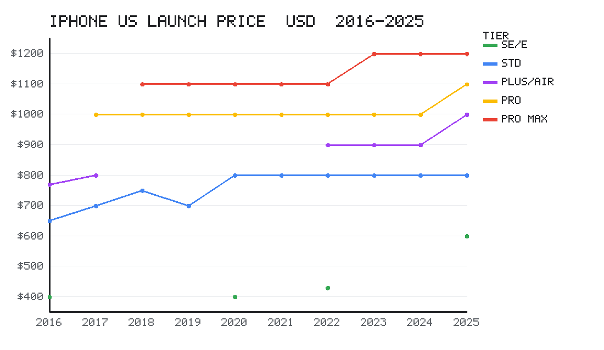
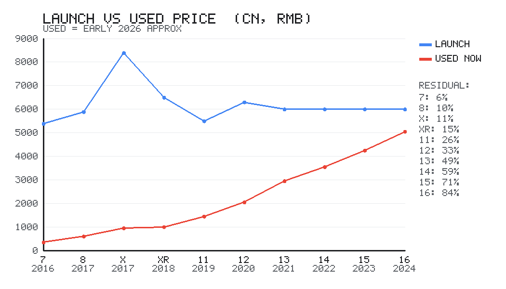
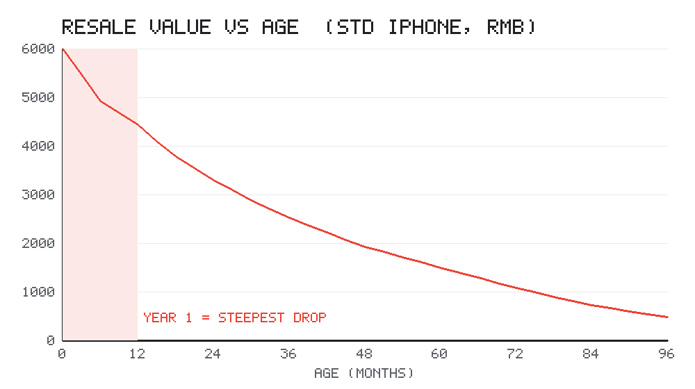
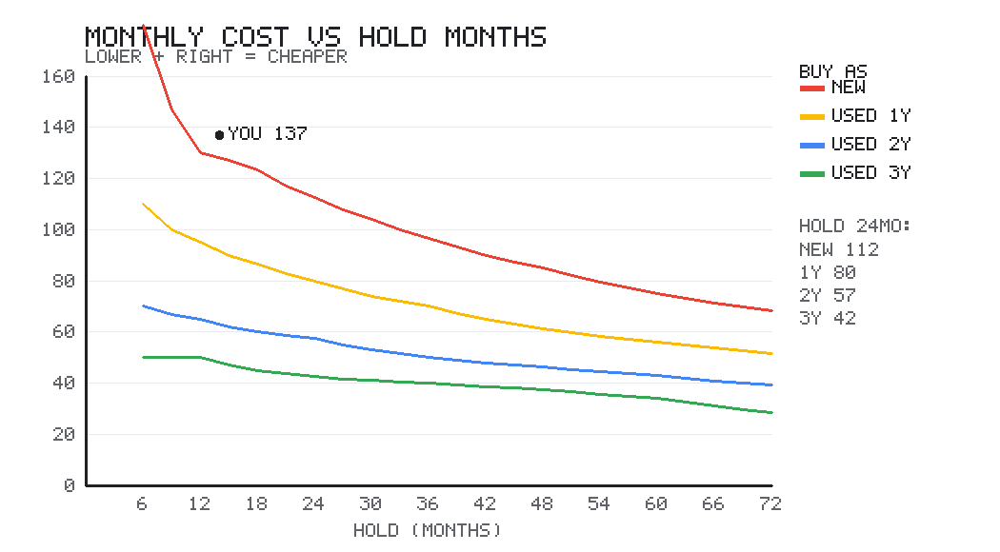
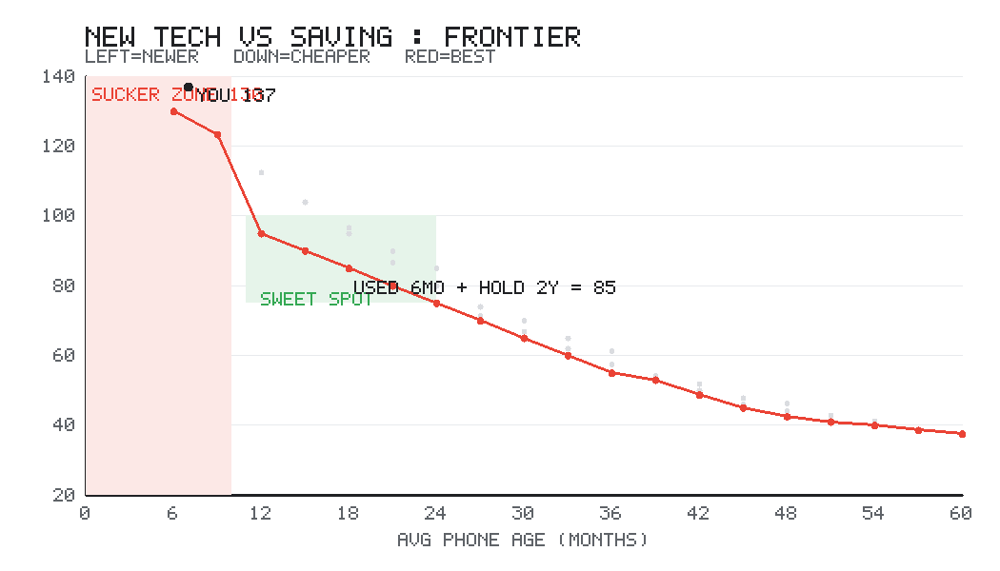

---

## 仓库结构与复现

```
report.md / report.html   完整报告(Markdown / 单页 HTML)
charts/                   6 张中文 SVG 图
charts/png/               5 张英文 PNG 图
scripts/                  纯 Python 脚本(含自写 PNG 渲染器,零依赖)
data/                     模型输出 JSON
```

```bash
python3 scripts/iphone_prices.py            # 历代发布价曲线
python3 scripts/iphone_secondhand_cn.py     # 国行首发 vs 二手
python3 scripts/iphone_strategy.py          # 成本模型 + strategy_data.json
python3 scripts/make_strategy_charts.py     # 折旧曲线 + 成本曲线图
python3 scripts/iphone_frontier.py          # 帕累托前沿 + frontier_data.json
python3 scripts/make_frontier_chart.py      # 前沿图(SVG)
python3 scripts/iphone18_forecast.py        # iPhone18 预测 + forecast.json
python3 scripts/make_iphone18_chart.py      # iPhone18 预测图
python3 scripts/make_png_charts.py          # 全部图的 PNG 版(无依赖)
python3 scripts/make_html.py                # 生成单页 report.html
```
