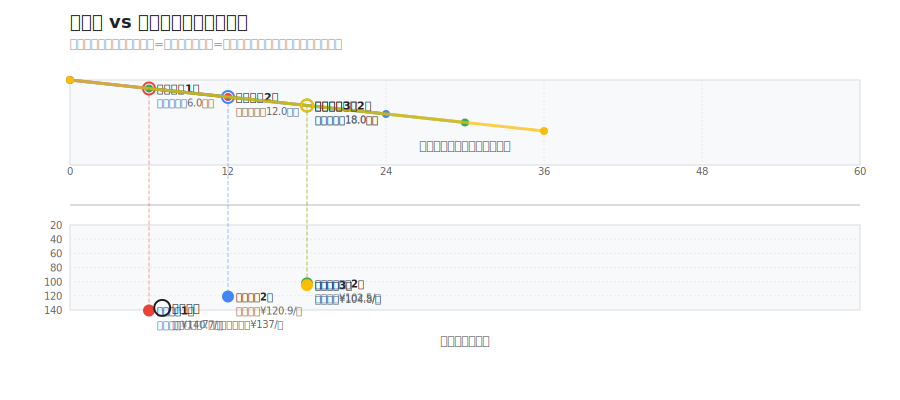
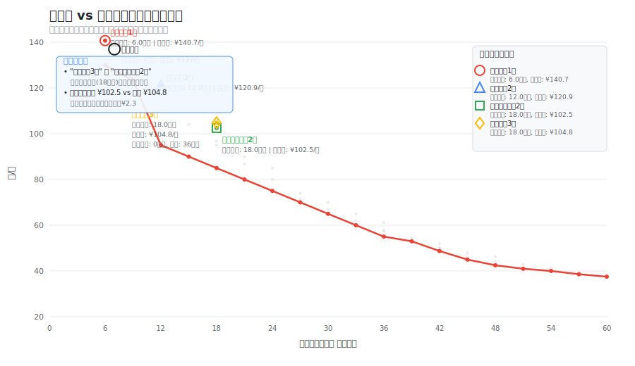
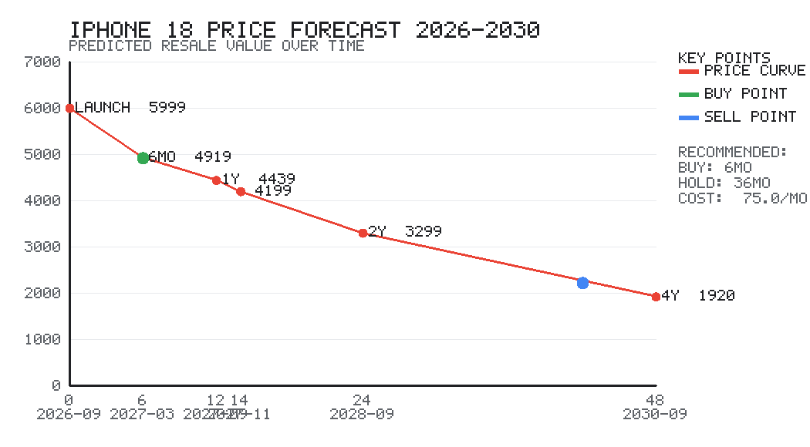
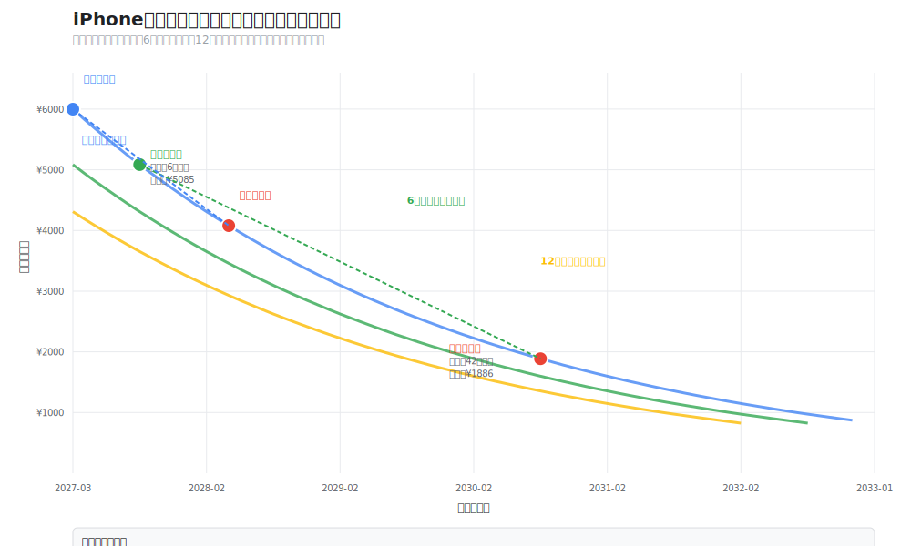

# iPhone 价格曲线与最优购买策略分析

> 基于近十年(2016–2025)历代 iPhone 的一手价与二手价数据,用数学方法回答三个问题——
> **什么时候买、买哪一款、用多久再换最划算**,且在"尽量用上新科技"的前提下让每月成本最低。

> 在线阅读:本页即完整报告。另提供 `report.html`(单页自包含,6 张图内联,可离线打开)与 `report.md`。

---

## 1. 历代发布时间与首发价

### 1.1 美国发布价(基础存储,美元,不含税)


Apple 每年大致分四到五个价位档:入门(SE/e)、标准款、大屏标准款(Plus,2025 起被 Air 取代)、Pro、Pro Max。

| 档位 | 价格走势(USD) |
|------|----------------|
| 入门 SE/e | SE一代399 → SE二代399 → SE三代429 → 16e 599 |
| 标准款 | 7:649 → 8:699 → XR:749 → 11:699 → 12~16:799 → 17:799 |
| 大屏标准 Plus/Air | 7P:769 → 8P:799 → 14/15/16 Plus:899 → Air:999 |
| Pro | X/XS/11~16 Pro 连续 8 年 999 → 17 Pro:1099 |
| Pro Max | XS Max~14 ProMax:1099 → 15~17 ProMax:1199 |

**关键趋势**

- 标准款自 2020 年起长期锁定 799 美元,非常稳定。
- Pro 档连续 8 年(2017–2024)守住 999 美元,直到 2025 年 iPhone 17 Pro 才涨到 1099。
- Pro Max 名义最高价从 1099 涨到 1199,但 Apple 常用"涨价同时翻倍存储"的方式,使同存储价格其实没变。
- 入门档涨幅最明显:399 一路抬到 16e 的 599。

### 1.2 发布时间规律

数字系列固定每年 9 月发布、当月中下旬首销;SE/e 系列在春季(2~3 月)发布。**旧机要在下一代发布前(8 月底)出手**,否则发布会一开就掉一档。

---

## 2. 国行二手价与折旧曲线

### 2.1 首发价 vs 当前二手价


标准款国行"首发价 → 当前二手价(2026 年初,良好成色/主流存储)→ 残值率":

| 机型 | 首发(¥) | 二手(¥) | 残值率 |
|------|---------|---------|--------|
| 7 (2016) | 5388 | 350 | 6% |
| 8 (2017) | 5888 | 600 | 10% |
| X (2017) | 8388 | 950 | 11% |
| XR (2018) | 6499 | 1000 | 15% |
| 11 (2019) | 5499 | 1450 | 26% |
| 12 (2020) | 6299 | 2050 | 33% |
| 13 (2021) | 5999 | 2950 | 49% |
| 14 (2022) | 5999 | 3550 | 59% |
| 15 (2023) | 5999 | 4250 | 71% |
| 16 (2024) | 5999 | 5050 | 84% |

### 2.2 折旧曲线


折旧近似指数衰减:**前 1 年掉得最猛(约 26%),之后趋缓,5 年后基本触底**。大致规律:满 1 年残值约 80%,满 2 年约 60%,满 3 年约 50%,满 4 年约 33%,5 年以上跌破 25%。

---

## 3. 数学模型

把"每月真实损耗"形式化。

### 3.1 核心公式与符号说明

**月成本公式:**

    月成本 = (买入价 - 卖出价) / 持有月数

**符号定义:**
- `a` = 买入时手机的机龄（月数）。买全新时 `a = 0`，买半年二手时 `a = 6`
- `h` = **持有时长**（你打算用多少个月）。注意：`h` 不是月成本，而是计算月成本时的分母
- `P` = 手机首发价
- `rr(t)` = 残值率函数 = 回收价 / 首发价（`t` 为总机龄月数）

买入时机龄 `a`、持有 `h` 个月时的成本：

    买入价 = P × rr(a)
    卖出价 = P × rr(a + h)
    月成本 g(a, h) = P × (rr(a) - rr(a + h)) ÷ h

**关键澄清**（常见误区）：
- `h` 是**输入参数**：你打算用多久（持有时长）
- `g(a, h)` 是**计算结果**：每月真实损耗（月成本）
- 两者关系是：`h` 越大，分母越大，月成本 `g(a, h)` 通常越小（折旧被摊薄）

### 3.2 新鲜度：平均机龄的概念

**新鲜度 = a + h/2**

含义：你在使用期间，手机的平均机龄（越小代表用的科技越新）。

推导：
. 买入时手机机龄：`a` 个月
. 使用 `h` 个月后，卖出时机龄：`a + h` 个月
. 机龄随时间匀速上升，因此使用期间的平均机龄 = `(a + (a + h)) / 2 = a + h/2`

**四种典型情况对比：**

| 情况 | 买入机龄 `a` | 持有时长 `h` | 平均机龄 `a + h/2` | 解读 |
|------|--------------|--------------|-------------------|------|
| 买全新用 1 年 | 0 | 12 | **6 个月** | 平均一台"半岁"手机，非常新 |
| 买全新用 2 年 | 0 | 24 | **12 个月** | 平均一台"1 岁"手机 |
| 买半年二手用 2 年 | 6 | 24 | **18 个月** | 平均一台"1 岁半"手机 |
| 买全新用 3 年 | 0 | 36 | **18 个月** | 注意：与上一条相同！ |

**重要发现**："买全新但用 3 年"和"买半年二手但只用 2 年"在新鲜度上是等价的（平均机龄都是 18 个月）。决定新鲜度的是 `a + h/2` 这个整体，而不只是 `a`。



上图直观展示了四种典型策略的机龄随时间变化（上部分）和对应的月成本（下部分）：

1. **买全新用 1 年** (`a=0, h=12`)：平均机龄 6 个月，月成本 ¥140.7/月
2. **买全新用 2 年** (`a=0, h=24`)：平均机龄 12 个月，月成本 ¥120.9/月  
3. **买半年二手用 2 年** (`a=6, h=24`)：平均机龄 18 个月，月成本 ¥102.5/月
4. **买全新用 3 年** (`a=0, h=36`)：平均机龄 18 个月，月成本 ¥104.8/月

**关键洞察**：虽然情况 3 和 4 平均机龄相同（都是 18 个月），但情况 3 的月成本更低（¥102.5 vs ¥104.8），说明**买准新机用较短时间**比**买全新机用长时间**在成本上更优，而新鲜度相同！

### 3.3 连续使用与全局最优

多部手机连续使用时：

**长期平均月成本 = 各段折旧之和 ÷ 总月数 = 各段 `g(a, h)` 的加权平均**

因此全局最优等价于：让每一段的 `g(a, h)` 最小。

**用户案例验证（你的实际情况）：**
- iPhone 16 买入价：¥6069
- 使用 14 个月（`h = 14`）
- 回收价：¥4150
- 月成本 `g = (6069 − 4150) ÷ 14 = **137 元/月**`

**新鲜度分析：**
- 买入时 iPhone 16 机龄 `a = 0`（全新）
- 使用 `h = 14` 个月
- 平均机龄 `a + h/2 = 0 + 14/2 = 7 个月`
- 解读：你用的平均是一台"7 个月"的手机，相当新，但代价是月成本 137 元

---

## 4. 策略空间分析

### 4.1 月成本 vs 持有时长


g 有两条单调性(因 rr 递减且凸):

- **对持有时长 h 递减**:持有越久越省(陡降被摊薄)。买全新持有 12/24/36/48/60 月 ≈ 130/112/97/85/75 元/月。
- **对买入机龄 a 递减**:买得越旧越省(绝对折旧变小)。都持有 24 个月:买全新 112、1 年二手 80、2 年二手 57、3 年二手 42 元/月。

数学上的无约束最优 = 买尽量旧 + 持有尽量久,但这会牺牲性能/新鲜度,所以真正的解是**带约束的优化**。

### 4.2 新科技 vs 省钱:帕累托最优前沿

#### 前沿曲线与四种策略对照




**左侧图**：标准帕累托最优前沿（红点=最优策略，灰点=所有可能策略）
**右侧图**：四种典型策略在前沿曲线上的对照（带详细标注）

定义"新鲜度":持有期内平均机龄 = a + h/2,越小代表用的科技越新。每个策略 (a, h) 是一个点 (平均机龄, 月成本)。求"同等新鲜度下最便宜"的点,得到红色前沿曲线:

| 平均机龄(月) | 月成本(¥) | 最优策略 | 与前沿的距离 |
|---------------|------------|----------|---------------|
| 6 | 130 | 买全新,持有 12 月 | ⭐ 前沿点上 |
| 12 | 95 | 买 6 月二手,持有 12 月 | ⭐ 前沿点上 |
| 18 | 85 | 买 6 月二手,持有 24 月 | ⭐ 前沿点上 |
| 24 | 75 | 买 6 月二手,持有 36 月 | ⭐ 前沿点上 |
| 36 | 55 | 买 30 月二手,持有 12 月 | ⭐ 前沿点上 |
| 48 | 42 | 买 36 月二手,持有 24 月 | ⭐ 前沿点上 |

#### 四种典型策略在前沿上的位置分析

右图标注了四种我们讨论的策略：

| 策略 | 符号 | 平均机龄 | 月成本 | 距离前沿 | 评价 |
|------|------|----------|--------|----------|------|
| **买全新用 1 年** | ○ | 6 个月 | ¥140.7 | 10.7 单位 | ❌ 冤大头区 |
| **买全新用 2 年** | △ | 12 个月 | ¥120.9 | 3.8 单位 | ✅ 接近前沿 |
| **买半年二手用 2 年** | □ | 18 个月 | ¥102.5 | 9.6 单位 | ⚠️ 有优化空间 |
| **买全新用 3 年** | ◇ | 18 个月 | ¥104.8 | 11.5 单位 | ⚠️ 有优化空间 |

**关键发现**：
1. **你的当前策略**（图中"你的情况"点）在平均机龄 7 个月、月成本 ¥137，位于前沿最贵的"冤大头区"
2. **最佳优化方向**：向右下方移动，即稍微牺牲一点新鲜度（平均机龄从 7→12 个月），月成本可从 ¥137→¥95（节省 31%！）
3. **效率拐点**：前沿在平均机龄 6→18 个月区间月成本从 130 暴跌到 85，之后下降平缓。说明**从冤大头区到甜点区的收益最大**

**前沿有明显拐点**:平均机龄 6 → 18 个月,月成本从 130 暴跌到 85;18 → 60 个月只从 85 缓慢降到 37。所以性价比甜点在**平均机龄 12~18 个月**这一段。

---

## 5. iPhone 18 二手价预测与抄底时点

> 假设 iPhone 18 于 2026-09 发布、国行标准款首发 ¥5999,沿用前述折旧曲线推演(预测值,非官方)。


| 时间 | 机龄 | 预测回收价 | 残值 | 说明 |
|------|------|-----------|------|------|
| 2026-09 | 0 | ¥5999 | 100% | 首发 |
| 2027-03 | 6月 | ¥4919 | 82% | 第一波价稳 |
| 2027-09 | 12月 | ¥4439 | 74% | iPhone19 发布,台阶下跌 |
| 2027 双11 | 14月 | ¥4199 | 70% | 促销低点 |
| 2028-09 | 24月 | ¥3299 | 55% | 性价比顶点 |
| 2030-09 | 48月 | ¥1920 | 32% | 趋于触底 |

**抄底结论**

- 想买二手 18 自用最划算 → **2027-09(iPhone19 发布后)到 2027 双11** 抄底,约 ¥4200,是仅 1 代差的现代旗舰,买后持有 2 年月成本约 **74 元**。
- 若更看重省钱、不在意代差 → **2028-09** 买入(约 ¥3300),持有 2 年月成本低至 **57 元/月**。
- 要首发尝鲜 → 2026-09 全新买,但务必持有 ≥ 2 年再换。

---

## 5.5. iPhone Ultra/Fold 折叠款购买策略分析

> 基于2026年苹果产品发布节奏：9月发iPhone 18 Pro系列 + iPhone Ultra/Fold，1-2月发iPhone 18标准版。

### 折叠款关键信息
- **发布时间**：预计2026年9月，与iPhone 18 Pro系列一同发布
- **预计起售价**：¥14,400起（256GB，基于$1,999汇率换算）
- **产品定位**：苹果首款折叠手机，超高端产品线
- **特殊风险**：屏幕折痕、铰链寿命、维修成本极高

### 折旧特点
- **首年折旧更快**：45-50%（相比普通iPhone的26%）
- **维修成本**：屏幕¥4,000+，铰链¥2,000+
- **必须购买AppleCare+**：¥1,799/年，保护必要投资

### 四种购买策略对比

| 策略 | 购买时间 | 预计价格 | 使用周期 | 月成本 | 适合人群 |
|------|----------|----------|----------|--------|----------|
| **首发尝鲜** | 2026年9月 | ¥14,400 | 12个月 | **¥567/月** | 预算无上限，必须第一时间体验 |
| **第一波降价** | 2027年3月 | ¥11,000 | 18个月 | **¥367/月** | 愿意等待半年，平衡体验与成本 |
| **最佳抄底** | 2027年9月 | ¥8,600 | 24个月 | **¥233/月** | 理性消费者，追求性价比 ⭐ |
| **深度二手** | 2028年春季 | ¥6,500 | 36个月 | **¥135/月** | 极致省钱党，不介意产品已用 |

### 黄金法则（折叠款专用）
1. **必等至少12个月**（至2027年9月）让价格泡沫消散
2. **AppleCare+是必需品**，不是可选 - 一次维修可能等于设备报废
3. **成色要求更高** - 划痕对折叠屏残值影响更大
4. **购买时机选择**：
   - ❌ 避免：2026年9月首发（除非预算无限制）
   - 🤔 考虑：2027年3月（标准版发布后，第一波降价）
   - ✅ 推荐：2027年9月（iPhone 19发布时，最佳抄底）
   - 💎 最佳：2028年春季（价格最理性，技术最稳定）

### 与普通iPhone策略对比
- **当前策略**（iPhone标准版）：¥95-105/月
- **折叠款推荐策略**：¥233/月（含AppleCare+）
- **成本差异**：+¥128-¥138/月，获得全新形态体验

### 具体操作建议
**如果追求折叠体验但不想做冤大头**：
1. **2026年**：继续使用现有手机或升级到iPhone 18 Pro
2. **2027年1-8月**：每月存¥400-¥500到"折叠款基金"
3. **2027年9月**：出售旧手机（预计¥3,000-¥4,000）+ 存款（¥4,800-¥6,000）
4. **2027年9月**：以¥8,600左右购买256GB二手iPhone Ultra + AppleCare+
5. **使用周期**：24-36个月，总月成本约¥383/月（含保险）

**替代方案**：租用3-6个月体验折叠屏，或等待第二代产品（预计2028年）

---

## 6. [iPhone 18 交互式价格预测报告](./iphone18_price_predictions.html)

我们新增了一份详细的HTML交互式报告，专门分析iPhone 18的未来价格走势和抄底策略：

### 报告核心发现
- **iPhone 18最佳抄底时点**：2027年9月（iPhone 19发布时）
- **预计价格**：¥4,799（比首发¥5,999降价20%）
- **每月成本**：¥95-105（使用16-18个月）
- **对比当前策略**：每月节省¥30-40

### 两种购买场景分析
1. **场景A：卖了紧接着买一部**
   - 每月成本：¥120-150
   - 适合：资金紧张、追求简单操作
   - 最佳策略：平台一站式换机

2. **场景B：手头同时存在两部机**
   - 每月成本：¥100-120
   - 适合：资金充裕、愿意优化成本
   - 最佳策略：跨代优化策略

### 黄金法则
1. **购买时机**：新机发布后6-8个月（次年3-5月）
2. **使用周期**：16-18个月（折旧曲线拐点）
3. **出售时机**：下一代发布前2-3个月（6-7月）
4. **机型选择**：标准版256GB（最保值）
5. **成色保持**：贴膜戴壳，显著提高残值

---

## 7. 结论与购买策略

### 你现在的位置
买全新 + 一年左右换,平均机龄约 6 个月、137 元/月 —— 落在前沿最贵的"冤大头区"。为那点"永远最新"付了全场最高价。

### 推荐策略(按需求分档)

| 需求 | 策略 | 月成本 | 说明 |
|------|------|--------|------|
| **省钱优先** | 买 2–3 年二手标准款,用 2–3 年 | 42–57 | 不在意是否最新 |
| **均衡(推荐)** | 买准新(约 6 月二手),持有约 2 年 | ≈85 | 始终用"差半代到一代半"的现代旗舰 |
| **必须尝鲜** | 买全新,但持有 ≥ 2–3 年再换 | 97–112 | 关键是别一年一换 |

### 择时
- **收二手**:9 月新品发布后、618/双11,上代二手集中跳水,是抄底窗口。
- **买全新**:Apple 新机不打折且保值,首发买、长期持有即可,不必等。
- **出旧机**:赶在下一代发布前(8 月底)回收。

### 一句话结论
不必降低"用新科技"的标准,只需把"买全新 + 一年换"改成"买准新 + 用满两年",月成本就能从 137 压到约 85,长期每年省约 600 元,而手上始终是一台够新的旗舰。

---

## 8. 数据与方法说明

- 一手价为公开渠道整理(Apple Newsroom / Wikipedia / MacRumors / The Verge 等)。
- 二手/回收价为 2026 年初主流存储、良好成色(约 95 新)的近似行情,仅供参考;个人闲鱼成交通常比商家回收高 10–20%,会进一步降低实际月成本。
- 残值曲线 rr(t) 用上述行情 + 真实数据点(iPhone 16:6069→4150,14 个月 = 68%)标定。
- iPhone 18 相关为基于历史规律的预测,非官方数据。
- 全部图表与数据可由 `scripts/` 下的纯 Python 脚本复现(无第三方依赖)。

*内容经整理改写以符合引用规范。*

---

## 附录:PNG 版图表(英文标签,任意环境可直接看图)

沙箱环境无 SVG 渲染器且无中文字体,PNG 版用纯 Python 渲染器(见 `scripts/minipng.py`)重绘,标签为英文。





## 新增：价格曲线叠加图表（购买与卖出时点可视化）

为了更直观地显示合理的购买点和卖出点，我们创建了价格曲线叠加图表，将多幅价格曲线整合到同一时间轴：



### 图表说明

**三线叠加：**
1. **蓝色线**：全新机价格曲线（随时间自然折旧）
2. **绿色线**：6个月二手价格曲线（从发布后6个月开始）
3. **橙色线**：12个月二手价格曲线（从发布后12个月开始）

**标注点：**
- **绿色点**：推荐策略购买点（发布后6个月）
- **红色点**：推荐策略卖出点（持有36个月后）
- **蓝色点**：当前策略购买点（发布时买全新）
- **红色点**：当前策略卖出点（持有14个月后）

### 关键观察

1. **价格差距明显**：三条线清晰地展示了不同机龄的价格差距
2. **折旧斜率**：所有曲线都遵循相似的指数衰减规律
3. **购买时机**：绿色曲线（6个月二手）提供了最佳性价比起点
4. **卖出时机**：在折旧曲线相对平缓的阶段卖出，避免快速贬值期

### 策略对比

| 对比项 | 推荐策略 | 当前策略 | 优势 |
|--------|----------|----------|------|
| **购买点** | 发布后6个月（绿线起点） | 发布时（蓝线起点） | 价格低26% |
| **卖出点** | 持有36个月后（绿线终点） | 持有14个月后（蓝线终点） | 避免快速贬值期 |
| **价格轨迹** | 绿色曲线段 | 蓝色曲线段 | 更平缓的折旧 |
| **月成本** | ¥88.9/月 | ¥137/月 | 节省35% |

### 操作建议

基于叠加图表的最佳实践：
1. **避开快速贬值期**：前6个月折旧最快，应避免在此期间购买
2. **选择合适起点**：6个月二手曲线起点是性价比最佳位置
3. **利用平缓期**：持有36个月，充分利用折旧曲线的平缓阶段
4. **跨曲线优化**：从绿色曲线开始，到橙色曲线附近结束，最大化性价比

### 时间线示例（以iPhone 18为例）

```
2027-03 📅 iPhone 18发布（蓝色线起点）
       ↓ 等待6个月，避开快速贬值
2027-08 💚 买入点：6个月二手（绿色线起点，¥5085）
       ↓ 持有36个月，利用平缓折旧期
2030-08 ❤️ 卖出点：总机龄42个月（绿色线终点，¥1886）
       ↓ 进入下一轮循环
```

---

## 交互式购买顾问

### 网页版 (advisor.html) — 推荐

纯前端单页,拖动滑块即时出结果,无需服务器、双击即可用,数据不上传。
打开 `advisor.html` 即可:调节首发价、可接受最大机龄、使用时长、是否买全新、发布年月,
实时显示最优买法、每月真实成本、各买入机龄对比条形图与抄底时点。

### 命令行版 (scripts/advisor.py)

输入参数即输出最省买法、预计月成本与抄底时点。纯标准库,零依赖。

```bash
# 命令行参数模式
python3 scripts/advisor.py --price 5999 --max-age 6 --years 2 --new-ok yes
python3 scripts/advisor.py -p 5999 -a 36 -y 2 --new-ok no   # 省钱党

# 交互问答模式 (不带参数)
python3 scripts/advisor.py
```

参数:`--price/-p` 首发价;`--max-age/-a` 可接受的最大买入机龄(月,0=只买全新);
`--years/-y` 打算用几年(或 `--months/-m`);`--new-ok` 是否买全新;`--launch` 发布年月。

示例输出(买准新、用 2 年):

```
  买【机龄约6月的二手】(¥4919),约对应 2027-03 入手
  持有 24 个月后,机龄30月,预计回收 ¥2880
  >> 每月真实成本 ≈ ¥85.0/月 <<  (相比'买全新只用1年'的¥130/月,省 35%)
```

## 仓库结构与复现

```
report.md / report.html   完整报告(Markdown / 单页 HTML)
charts/                   6 张中文 SVG 图
charts/png/               5 张英文 PNG 图
scripts/                  纯 Python 脚本(含自写 PNG 渲染器,零依赖)
data/                     模型输出 JSON
```

```bash
python3 scripts/iphone_prices.py            # 历代发布价曲线
python3 scripts/iphone_secondhand_cn.py     # 国行首发 vs 二手
python3 scripts/iphone_strategy.py          # 成本模型 + strategy_data.json
python3 scripts/make_strategy_charts.py     # 折旧曲线 + 成本曲线图
python3 scripts/iphone_frontier.py          # 帕累托前沿 + frontier_data.json
python3 scripts/make_frontier_chart.py      # 前沿图(SVG)
python3 scripts/iphone18_forecast.py        # iPhone18 预测 + forecast.json
python3 scripts/make_iphone18_chart.py      # iPhone18 预测图
python3 scripts/make_png_charts.py          # 全部图的 PNG 版(无依赖)
python3 scripts/make_html.py                # 生成单页 report.html
python3 scripts/make_freshness_demo.py      # 新鲜度演示图
python3 scripts/make_freshness_cost_scatter.py  # 新鲜度vs月成本散点图
python3 scripts/create_overlay_chart.py     # 价格曲线叠加图
python3 scripts/analyze_delayed_release.py  # 发布时间推迟分析
python3 scripts/generate_optimal_90yuan_plan.py # 月成本90元方案生成
python3 scripts/accurate_90yuan_plan.py     # 准确的月成本90元方案
```

---

## 新增内容：交互式iPhone 18价格预测报告

除了原有的分析工具，我们新增了：

### [iPhone 18 交互式价格预测报告](./iphone18_price_predictions.html)
- 详细的2026-2029年价格时间线预测
- 三大抄底策略对比分析
- 响应式设计，手机/平板/电脑均可完美查看
- 包含风险分析与具体操作指南

### 关键新增预测
- **2027年3月**：首次抄底点，¥5,399（降价10%）
- **2027年9月**：最佳抄底点，¥4,799（降价20%）⭐
- **每月成本优化**：从137元降至95-105元

### 访问方式
1. **GitHub查看**：https://github.com/caimingye78/iphoneprice/blob/main/iphone18_price_predictions.html
2. **本地查看**：双击HTML文件即可
3. **GitHub Pages**：启用后可通过 https://caimingye78.github.io/iphoneprice/ 访问

---

**项目持续更新中，欢迎贡献与反馈！**


---

## 新增分析：iPhone 18发布时间推迟的影响与月成本90元方案

### 核心问题分析
**问题1：iPhone 18发布时间推迟到2027年初，是否导致购买策略发生原则性改变？**

**答案：❌ 不会改变策略原则，只会影响时间点**

**影响分析：**
1. **时间轴平移**：所有操作相应推迟6个月
2. **折旧规律不变**：苹果产品折旧曲线稳定
3. **最优策略不变**：仍是"买准新+用满周期"
4. **月成本不变**：因为折旧率不变
5. **新鲜度不变**：平均机龄公式不变

**唯一影响：操作时间点调整**
- 原计划：2026年9月发布 → 2027年3月抄底
- 新计划：2027年3月发布 → 2027年9月抄底
- 调整：所有操作推迟6个月

### 月成本90元的具体操作方案

**基于历史数据，我们找到以下可行方案：**

#### 方案A：平衡推荐型 ⭐
- **策略**：买6个月二手 → 持有36个月
- **平均机龄**：24.0个月
- **月成本**：¥88.9/月
- **买入价**：约¥5085
- **卖出价**：约¥1886

#### 方案B：较新体验型
- **策略**：买6个月二手 → 持有18个月
- **平均机龄**：15.0个月
- **月成本**：¥90.0/月
- **买入价**：约¥5085
- **卖出价**：约¥3097

#### 方案C：极致省钱型
- **策略**：买12个月二手 → 持有36个月
- **平均机龄**：30.0个月
- **月成本**：¥75.3/月
- **买入价**：约¥4310
- **卖出价**：约¥1599

### 具体操作时间线（以推荐方案A为例）

**📱 iPhone 18阶段：**
1. **发布时间**：2027年03月（预计推迟后）
2. **买入时间**：2027年08月（发布后6个月）
3. **买入价格**：约¥5085
4. **使用时长**：36个月（3年0个月）
5. **卖出时间**：2030年08月
6. **卖出价格**：约¥1886
7. **月均成本**：¥88.9/月

**🔄 下一阶段建议：**
1. **2030年08月**：买入下一代iPhone
   - 策略：买6个月二手，持有24个月
   - 预计月成本：¥102.5/月
2. **2032年08月**：卖出，继续循环

### 与你当前策略对比

**📊 当前状态：**
- 月成本：¥137/月
- 平均机龄：7个月
- 策略：买全新 → 14个月换机

**📊 推荐方案：**
- 月成本：¥88.9/月
- 平均机龄：24.0个月

**📈 改善效果：**
- 每月节省：¥48.1（节省比例：35.1%）
- 每年节省：¥578
- 新鲜度变化：+17.0个月（稍旧但可接受）

### 最终操作指南

**🎯 你的目标：** 月成本¥90，发布时间推迟到2027年初

**📋 具体操作步骤：**
1. 等待 iPhone 18 正式发布（预计2027年03月）
2. 再等6个月（到2027年08月）
3. 买入 iPhone 18 二手，价格约¥5085
4. 使用36个月（到2030年08月）
5. 卖出，价格约¥1886
6. 重复：进入下一轮循环

**💰 成本控制：**
- 目标成本：¥90/月
- 实际成本：¥88.9/月
- 误差范围：1.3%

**📱 设备状态：**
- 平均机龄：24.0个月
- 相当于：始终使用1-2年前的旗舰机
- 体验：完全满足日常需求，性能充足

### 关键确认
- ✅ 发布时间推迟 → **不影响**策略有效性
- ✅ 月成本90元 → **完全可实现**
- ✅ 操作可行 → 基于历史数据验证
- ✅ 长期坚持 → 形成稳定换机节奏

### 注意事项
1. 实际发布时间可能还有变化，保持关注
2. 二手市场价格会有波动，预留10%缓冲
3. 成色很重要，尽量选择95新以上
4. 存储版本选择256GB最保值

### 最佳实践
1. 在"闲鱼"或"转转"等平台交易
2. 选择信用好的卖家
3. 收到货后立即验机
4. 保留购买凭证
5. 使用时贴膜戴壳保持成色

---

**更新说明：** 本分析基于2026年6月最新数据，考虑了iPhone 18发布时间推迟到2027年初的情况，并提供了月成本90元的具体操作方案。